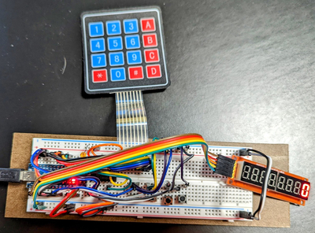
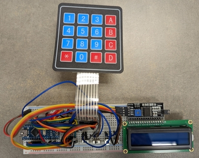
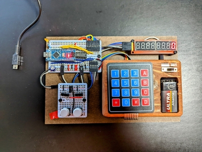
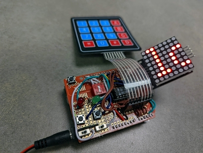
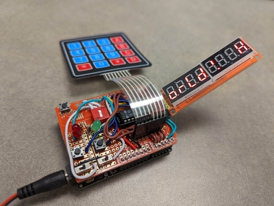
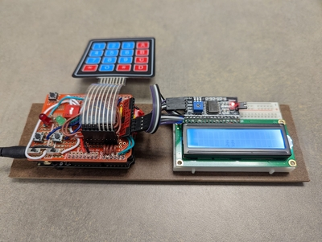
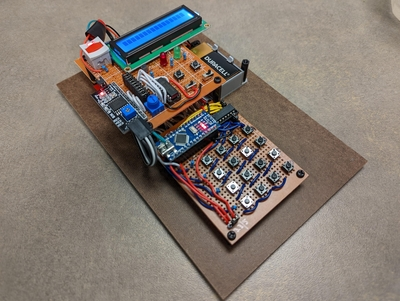
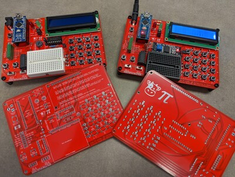
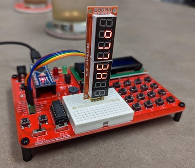

# Cow Pi hardware

The Cow Pi hardware is designed to support lab assignments in which students
learn to use memory-mapped I/O and interrupt-driven I/O. It consists of a
microcontroller board, two toggle-able switches, two momentary (normally-open)
switches, a matrix keypad, two LEDs (one might be an LED on the microcontroller
board), and a display module.

In broad strokes, a [Mark 1 Cow Pi](#mark-1-series) is built using a solderless
breadboard. A [Mark 2 Cow Pi](#mark-2-series) is a one-off circuit built using one
or more perfboards. A [Mark 3 Cow Pi](#mark-3-series) is built using a
through-hole printed circuit board. Eventually, a Mark 4 Cow Pi will use a
surface-mount printed circuit board.

## Mark 1 Series

The Mark 1 series is designed to be constructed by a student using a solderless
breadboard. We make no assumptions about psychomotor skills other than being
able to insert components and wires into the correct locations on a breadboard.
Specifically, we do not assume that computer science or software engineering
students can solder or trim wires.

### mk1a (*obsolete*)

The original.
- Microcontroller board: Arduino Nano
- Toggle-able switches: breadboard-mountable SPDT switches; the input pins were
  set to high-impedance, and the switches drove the pin high or low
- Momentary switches: two-lead 6mm tactile switches; the input pins were set to
  use the Arduino's internal pull-up resistors
- Matrix keypad
- Because the ATMega328P only supports external interrupts on two pins, we
  included NAND gates to generate an external interrupt if either tactile switch
  were pressed, and an external interrupt if any key on the keypad were pressed
  - While the ATMega328P supports pin change interrupts on all pins, we wanted
    students to configure interrupts at both the register level and using
    higher-level abstractions; the Arduino core library doesn't have a higher
    abstraction for pin change interrupts, but it does for external interrupts
- One external LED and one internal LED
  - The internal LED is not usable when using the SPI hardware since the same
    pin is used for both the internal LED and for the SCK signal
- Display module: MAX7219-based 8-digit 7-segment display

The Cow Pi mk1a is obsolete because the CowPi library's `cowpi_setup()` function
(version 0.2.0 and later) configure the pins for the toggle-able switches to use
internal pull-up resistors instead of high-impedance to be driven.

### mk1b (*obsolete*)

Change from mk1a:
- Treated toggle-able switches as SPST
  - Removed wire from one of switches' poles to Vcc
  - Other pole remained wired to ground
  - Manufacturing tolerances resulted in a small but significant fraction of the
    switches, when used as part of the mk1a configuration, to briefly short Vcc
    to ground when toggling

The Cow Pi mk1b remains compatible with the CowPi library (a/o version 0.3.0).
We consider the Cow Pi mk1b to be obsolete only because we are no longer
publishing construction instructions for the mk1b. The Cow Pi mk1c is
functionally and electrically equivalent to the mk1b and should be used instead.

### mk1c & mk1d

The Cow Pi mk1c is functionally and electrically equivalent to the mk1b. The
mk1c differs from the mk1b only in the placement of the inputs, to increase
commonality with the mk1d (thereby simplifying maintenance of the construction
instructions).

Changes from mk1b:
- Repositioned inputs to make room for mk1d's display module and to reduce the
  distance between the switches and their microcontroller input pins in the mk1d
  configuration
- Connected SPDT switches' center pins to ground and one pole to the
  microcontroller input pins to reduce the distance between the switches and
  their microcontroller input pins, to be within range of a 10cm Dupont wire
- mk1d only:
  - Different display module with different communication protocol
  - Different input pins for toggle-able switches (due to change in protocol)
  - Internal LED always available (due to change in protocol)

#### mk1c

- Microcontroller board: Arduino Nano
- Display module: MAX7219-based 8-digit 7-segment display (SPI)

#### mk1d

- Microcontroller board: Arduino Nano
- Display module: 2x16 character LCD dot-matrix display (I^2^C)

### Future Mark 1 Models

We expect the mk1e & mk1f to use the Arduino Nano Every and will not have the
NAND gates. We may introduce versions that use ARM-based microcontroller boards
that use the Arduino Nano form factor. We may introduce a version that fits on
a proto-shield for the Arduino Uno. We will introduce a version that uses the
Raspberry Pi Pico

## Mark 2 Series

The Mark 2 series is a collection of one-off designs that use perfboards. We
built them partly to have more-durable (and aesthetically-pleasing) versions of
the Cow Pi circuits that our students were using, and partly for some
experimentation. Because these are one-off designs, there are no design
documents to be published. If you want durable Cow Pi circuits, we recommend the
Mark 3 (and eventually the Mark 4 series) which will have designs published for
fabrication and can be constructed much faster and with less opportunity for
error.

### mk2a

- Microcontroller board: Arduino Nano
- Display module: MAX7219-based 8-digit 7-segment display (SPI)

Made from "perma-proto boards" in the half-length and quarter-length breadboard
form factor, with a membrane keypad affixed to a solid surface, and with a 9V
battery for power when not connected to a host computer, the Cow Pi mk2a can
change between being equivalent to the mk1a and the mk1b (and mk1c) by the
insertion/removal of a jumper. A detail-focused observer will notice there's
also a large capacitor in the circuit; we added this to help the ATMega328P
ride-out brownouts resulting from a brief shorting of power to ground when the
jumper is inserted to be equivalent to the mk1a.

The mk2a has very nice lines, if we do say so ourselves.

### mk2b

- Microcontroller board: Arduino Nano
- Display module: header strip to receive arbitrary display modules

Made from a "perma-proto shield" for an Arduino Uno, the Cow Pi mk2b was made
primarily for experimentation with different display modules. It being more
compact than the mk2a was a nice side-benefit when bringing it to class for
demonstrations.

A single 11-socket female header can accept a MAX7219-based 8x8 LED matrix
face-up (SPI, sockets 1-5), a MAX7219-based 8-digit 7-segment display face-up
(SPI, sockets 5-9), or a common serial adapter for an LCD1602 display mounted
piggyback on the face-up display (I^2^C, sockets 8-11) -- though we soon
discovered that the weight of the LCD1602 would cause the Arduino Uno to tip
over. Other display modules are also usable (such as an SPI adapter for the
LCD1602) but they might have to be connected by Dupont wires instead of being
directly inserted into the sockets.

A DPDT dip switch changes the toggle-able switches' input pins to free-up the
pins needed for SPI or for I^2^C, depending on which communication protocol
needs to be used. Because of this flexibility, the mk2b can be quickly
configured to be equivalent to the mk1b/mk1c, to the mk1d, and to other
configurations that are not available in the Mark 1 series. This flexibility was
key in designing the Cow Pi mk3a.

The mk2b has a clean, compact look to it. Our only regret is that some wiring
simplifications we made make it usable only for the Arduino Uno and not for the
Arduino Mega 2560 (since the '2560 wasn't a consideration in creating the mk2b,
we really don't consider this to be a failure -- just a missed opportunity).

### mk2c

- Microcontroller board: Arduino Nano or Arduino Nano Every
- Display module: 2x16 character LCD dot-matrix display (SPI or I^2^C)

The impetus for the Cow Pi mk2c was to create a durable version of the mk1d, but
as part of preparing for the mk3a, we included the ability to switch between the
I^2^C adapter component and a 74HC595-based SPI adapter circuit for the
LCD1602. We also, as part of experimentation with ARM-based microcontrollers and
the display modules, incorporated options to change between 5V and 3.3V at
various stages between the microcontroller board and the display module.

We built the mk2c from bakelite perfboard squares, perfboard-mountable
components, a 3D-printed 9V battery holder, and that's it. The membrane keypad
used in the Mark 1 series and in the mk2a & mk2b was replaced with sixteen
tactile switches. We added 100Ω resistors to the keypad's rows so that we can
safely and accurately detect up to two keys pressed simultaneously.

If the mk2a and mk2b are visually appealing, the mk2c isn't. Its complexity
both detracts from its appearance and made for a difficult build.

## Mark 3 Series

The Cow Pi Mark 3 series can be thought of as a staging series to proof designs,
leading to the Mark 4 series. They use through-hole PCBs. (The Mark 4 series
will use surface-mount PCBs and will be assembled before the students receive
them.) If students know how to solder, Mark 3 Cow Pis would be perfectly
appropriate for them and should be less expensive than having Mark 4 Cow Pis
assembled at a PCB Assembly facility (but will be more expensive than Mark 1 Cow
Pis).

### mk3a

- Microcontroller board: Arduino Nano or Arduino Nano Every
- Display module: 2x16 character LCD dot-matrix display (SPI or I^2^C)

The Cow Pi mk3a is configurable *at assembly time* to use SPI or I^2^C; the
selection will be based on which components are soldered to the board.
Dynamically changing the protocol (like the mk2b) will not be possible. Like the
mk2c, the is sixteen tactile switches, though sixteen diodes replace the four
resistors, which should make it possible to safely and accurately detect up to
sixteen keys pressed simultaneously. A breakout header and a mini-breadboard
will make it possible to attach sensors and actuators beyond those that are part
of the Cow Pi circuit.

While the PCB accommodates the LCD character display, other displays (indeed,
other components in general) can be used by taking advantage of the breakout
header. For example, to use the MAX7219-based 8-digit 7-segment display:

- If the board is configured for SPI then place the `SPI-LCD1602 Enable/Disable`
  shunt jumper to the `Disable` position.
- If the board is configured for I^2^C then slide both slide-switches to the right.
- Use jumper wires to connect the display module's `VCC` pin to `5V`, `GND` to `GND`, `DIN` to `COPI-D11`, `CS` to `CS-D10`, and `CLK` to `SCK-D13`.
  - You can, of course, use a different Arduino pin for `CS` which would
    eliminate the need to disable the LCD1602 when the board is configured for
    SPI, but the CowPi library's built-in MAX7219 functions assume that `D10` is
    used. Fortunately, the point of this board is to support labs in which
    students will write their own functions, so there you go.

#### LIBRARY NOTE

The CowPi library v0.3.0 works just fine with the ubiquitous I^2^C-LCD1602
interface module used that the mk3a board uses when it's configured for I^2^C. The
CowPi library v0.3.0 works just fine with the mapping of shift register bits to
LCD1602 bits when using the AdaFruit SPI/I^2^C-LCD1602 interface module in SPI
mode. For the Cow Pi Mark 3 and 4 series, we elected to have the SPI bit mapping
match the I^2^C bit mapping, and we haven't yet updated the library's LCD1602
SPI functions to use this particular mapping. Naturally, you can expect this
mapping to be supported in the next library update. (Also, this being a board to
support labs in which students will write their own functions, you can always do
that.)
